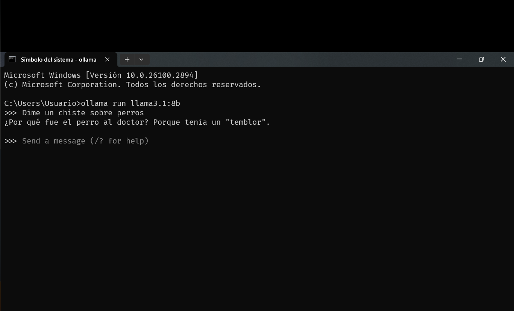
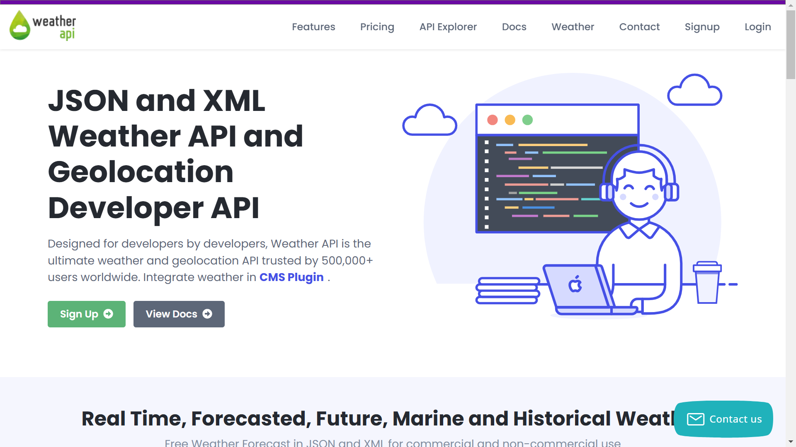
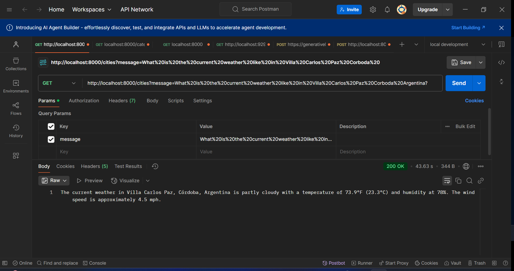
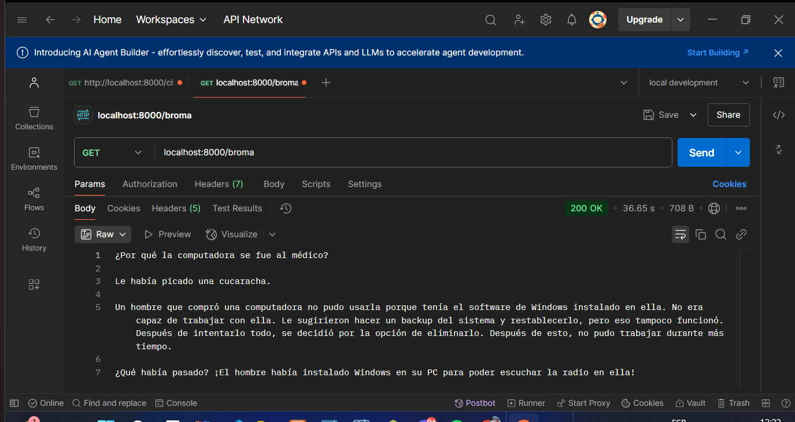
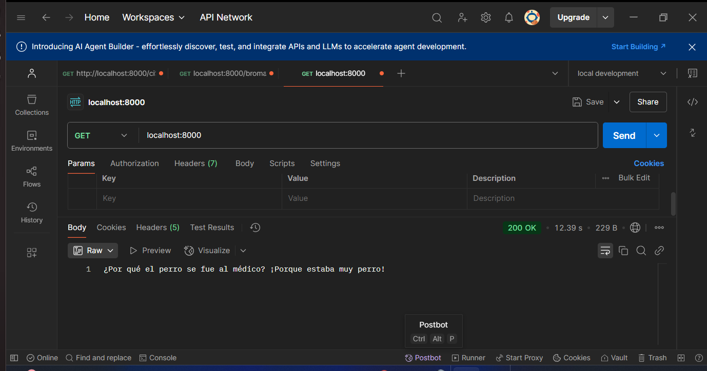

<h1 style="text-align: center;">
    Uso de IA 
     
con Spring
</h1>


___
# Descripción 📖
### Uso de Llama 3.1 (versión gratuita)

# ChatController
### Este controlador maneja solicitudes relacionadas con la generación de chistes. Utiliza un cliente de chat (ChatClient) para interactuar con un modelo de inteligencia artificial que responde a solicitudes de chistes.   

# Funcionalidades:   
### Endpoint:
````
http://localhost:8000/broma
````
### Devuelve un chiste de papá sobre computadoras.   
### Endpoint:
````
http://localhost:8000
````
### Devuelve un chiste de papá sobre perros.   
# Uso:   
### Envía una solicitud GET a /broma para obtener un chiste relacionado con computadoras.   
### Envía una solicitud GET a la raíz (/) para obtener un chiste sobre perros.   
### Ambos endpoints utilizan el cliente de chat para generar respuestas dinámicamente basadas en el modelo de inteligencia artificial configurado.   

# CityController   
### Este controlador maneja solicitudes relacionadas con información sobre ciudades. Utiliza un cliente de chat (ChatClient) configurado para actuar como un asistente de inteligencia artificial especializado en responder preguntas sobre ciudades de todo el mundo.   

# Funcionalidades:
### Endpoint /cities: Recibe un mensaje como parámetro y devuelve una respuesta generada por el modelo de inteligencia artificial.   
### Funcionalidad por defecto: Incluye la función currentWeatherFunction para obtener información sobre el clima actual.   
# Uso:
### Envía una solicitud GET a /cities con un parámetro message que contenga tu pregunta sobre una ciudad por ejemplo.
````
http://localhost:8000/cities?message=What%20is%20the%20current%20weather%20like%20in%20Villa%20Carlos%20Paz%20Corboda%20Argentina?
````

### El controlador devuelve una respuesta relevante basada en el modelo de inteligencia artificial configurado.   
___
# Recursos 👾


| Plugin                      | URL                      |
|-----------------------------|--------------------------|
| spring-boot-starter-web     | https://start.spring.io/ |
| spring-ai-ollama-spring-boot-starter | https://start.spring.io/ |


___
# Herramientas utilizadas 🛠️

&nbsp;
&nbsp;
&nbsp;
&nbsp;
&nbsp;


&nbsp;&nbsp;&nbsp;&nbsp;&nbsp;&nbsp;&nbsp;&nbsp;&nbsp;[](LICENSE)&nbsp;&nbsp;&nbsp;&nbsp;&nbsp;&nbsp;
___

# Pasos a seguir descargar la versión de Llama 3.1

☑️ Llama: Abre la url [Visita Llama.com](https://www.llama.com/)

# Leer la Documentación

☑️ Llama: Abre la url [Visita Llama.library](https://ollama.com/library/llama3.1:8b)

# Tener en cuenta la version que deseas descargar.

☑️ Llama: Abre la url [Visita Ollama.com](https://ollama.com/)

👁️ Además agregar en nuestro archivo **application.properties** o **application.yaml**
``` bash
spring.ai.ollama.chat.model=llama3.1
spring.ai.ollama.chat.enabled=true
```
___
# Crear la API KEY de Weatherapi

☑️ Weatherapi: Abre la url [Visita Weatherapi.com](https://www.weatherapi.com/)    

Agregamos al archivo application.properties:
````
weather.api-key=${WEATHER_API_KEY}
weather.api-url=https://api.weatherapi.com/v1
````
# El endpoint de ejemplo es:
````
http://localhost:8000/cities?message=What%20is%20the%20current%20weather%20like%20in%20Villa%20Carlos%20Paz%20Corboda%20Argentina?
````
# Observaciones se debe agregar al 'main' [ ]:
````
[@EnableConfigurationProperties(WeatherConfigProperties.class)]
@SpringBootApplication
public class Llama31Application {

	public static void main(String[] args) {
		SpringApplication.run(Llama31Application.class, args);
	}

}
````

___
# Imagenes:











___
# Ejecutar el Proyecto ⚙️
1 - Clona el repositorio en tu máquina local
``` bash
git clone
<https://github.com/toby959/gemini-chat.git>
```
2 - Compila y ejecuta el archivo GeminiChatAplication.java
___


# Colaboraciones 🎯
Si deseas contribuir a este proyecto, por favor sigue estos pasos:

1 - Haz un fork del repositorio: Crea una copia del repositorio en tu cuenta de GitHub.
2 - Crea una nueva rama: Utiliza el siguiente comando para crear y cambiar a una nueva rama:
```bash
git chechout -b feature-nueva
```
3 - Realiza tus cambios: Implementa las mejoras o funcionalidades que deseas agregar.
4 - Haz un commit de tus cambios: Guarda tus cambios con un mensaje descriptivo:
```bash
git commit -m 'Añadir nueva funcionalidad'
```
5 - Envía tus cambios: Sube tu rama al repositorio remoto:
````bash
git push origin feature-nueva
````
6 - Abre un pull request: Dirígete a la página del repositorio original y crea un pull request para que revisemos tus cambios.

💥Gracias por tu interés en contribuir a este proyecto. ¡Esperamos tus aportes!
___

## Licencia 📜

#### Este proyecto está licenciado bajo la Licencia MIT - ver el archivo [LICENSE](https://github.com/toby959/gemini-chat/blob/main/LICENSE) para más detalles.
